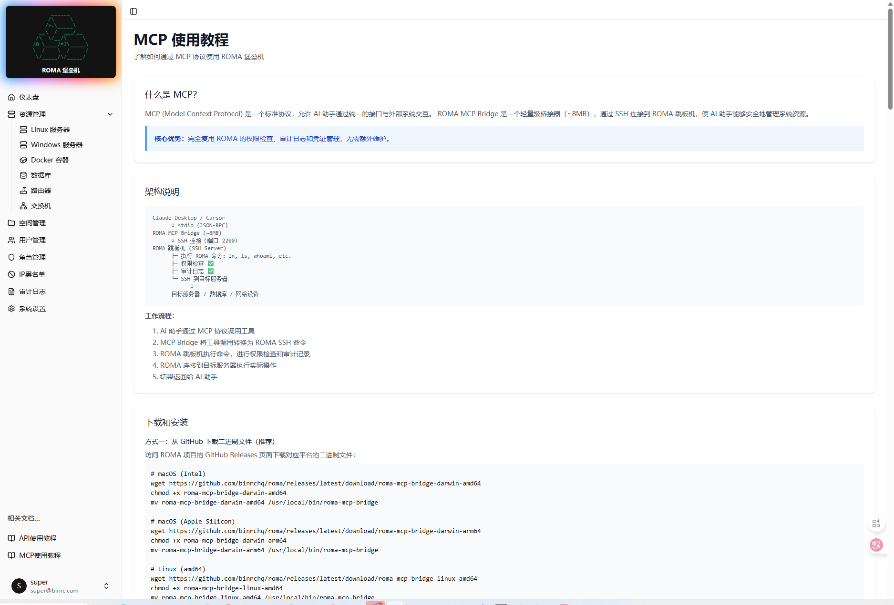

# ROMA Web - Management Interface


Modern management interface for ROMA jump server built with React + Vite + TailwindCSS.

**Related Projects:** [ROMA Core](https://github.com/binrchq/roma) • [MCP Server](https://github.com/binrchq/roma-mcp) • [Official Site](https://roma.binrc.com)

Language: English • [中文](./README_CN.md)

---

## Quick Start

### Docker Quick Start (Recommended)

```bash
# Pull image
docker pull binrc/roma-web:latest

# Start container
docker run -d -p 7000:80 \
  -e VITE_API_BASE_URL=http://your-roma-api:6999/api/v1 \
  binrc/roma-web:latest

# Access
open http://localhost:7000
```

### Online Demo

**https://roma-demo.binrc.com**
- Credentials: ***demo/demo123456***

---

<div align="left">
  
</div>

## Tech Stack

- **React 18** - UI framework
- **Vite** - Build tool
- **TailwindCSS** - CSS framework
- **React Router** - Routing
- **Axios** - HTTP client
- **Zustand** - State management

## Key Features

- **Modern Design** - Responsive interface based on TailwindCSS
- **Real-time Dashboard** - Resource statistics and status monitoring
- **Resource Management** - Support for 6 resource types (Linux/Windows/Docker/Database/Router/Switch)
- **User Management** - CRUD operations for users and roles
- **SSH Key Management** - Upload, generate and manage SSH keys
- **Audit Logs** - Complete access log viewing
- **System Settings** - API Key and system configuration
- **Dark Mode** - Light/dark theme switching
- **Secure Authentication** - Token and API Key dual authentication

## Local Development

### Requirements

- Node.js 18+
- npm or pnpm

### Install Dependencies

```bash
npm install
# or
pnpm install
```

### Development Mode

```bash
npm run dev
```

Visit http://localhost:3021

### Environment Configuration

Create `.env.local` file:

```env
# Backend API address
VITE_API_BASE_URL=http://localhost:6999/api/v1
```

### Production Build

```bash
npm run build
```

### Preview Build

```bash
npm run preview
```

## Project Structure

```
src/
├── components/       # Reusable components
│   └── Layout.jsx   # Main layout component
├── pages/           # Page components
│   ├── Dashboard.jsx
│   ├── Resources.jsx
│   ├── Users.jsx
│   ├── Roles.jsx
│   ├── Logs.jsx
│   └── Settings.jsx
├── utils/           # Utility functions
│   └── api.js      # API request wrapper
├── App.jsx         # App entry
├── main.jsx        # React entry
└── index.css       # Global styles
```

## API Configuration

Configure API base URL in `src/utils/api.js`:

```javascript
const apiClient = axios.create({
  baseURL: '/api/v1',
})
```

## Proxy Configuration

In development, Vite automatically proxies `/api` requests to backend service:

```javascript
// vite.config.js
server: {
  proxy: {
    '/api': {
      target: 'http://localhost:8080',
      changeOrigin: true,
    }
  }
}
```

## Docker Deployment

### Build Image

```bash
docker build -t roma-web:latest .
```

### Run Container

```bash
docker run -d \
  --name roma-web \
  -p 7000:80 \
  -e VITE_API_BASE_URL=https://your-roma-api.com/api/v1 \
  roma-web:latest
```

### Docker Compose

```yaml
services:
  roma-web:
    image: binrc/roma-web:latest
    ports:
      - "7000:80"
    environment:
      - VITE_API_BASE_URL=http://roma-backend:6999/api/v1
    depends_on:
      - roma-backend
```

---

## Related Projects

ROMA ecosystem includes multiple projects:

### [roma](https://github.com/binrchq/roma)
ROMA core jump server service (Go)

**Features:**
- SSH jump server service (port 2200)
- RESTful API service (port 6999)
- Resource management and connection handling
- User authentication and access control

**Quick Start:**
```bash
curl -O https://raw.githubusercontent.com/binrchq/roma/main/deployment/quickstart.yaml
docker compose -f quickstart.yaml up -d
```

---

### [roma-mcp](https://github.com/binrchq/roma-mcp)
Standalone MCP server for AI integration

**Features:**
- Full MCP protocol support
- 20+ AI tools for infrastructure management
- Compatible with Claude Desktop, Cursor and other clients
- Independent deployment, flexible configuration

**Use Cases:**
- AI-driven operations automation
- Natural language infrastructure control
- Intelligent fault diagnosis and remediation

---

### Project Comparison

| Project | Purpose | Tech Stack | Port |
|---------|---------|------------|------|
| **roma** | Core jump server | Go | 2200 (SSH), 6999 (API) |
| **roma-web** | Web management UI | React + Vite | 7000 (HTTP) |
| **roma-mcp** | AI integration service | Go | stdio (MCP) |

---

## Usage Guide

### First Login

1. Ensure ROMA backend service is running
2. Visit Web interface `http://localhost:7000`
3. Login with configured account (default: demo/demo123456)
4. Upload SSH public key (Settings → SSH Keys)

### Add Resources

1. Navigate to corresponding resource page (Linux/Windows/Docker etc.)
2. Click "Add Resource" button
3. Fill in resource information (name, address, port, credentials etc.)
4. Save and connect via SSH

### API Key Management

1. Go to "Settings" page
2. View or generate new key in "API Keys" section
3. Copy key for API calls

---

## Troubleshooting

### Issue: Cannot connect to backend

**Solution:**
```bash
# Check environment variable
echo $VITE_API_BASE_URL

# Check backend service status
curl http://localhost:6999/health
```

### Issue: Login failed

**Solution:**
- Check username and password are correct
- Verify backend user configuration
- Check browser console for errors

### Issue: Seeing development components in production

**Solution:**
- Ensure using production build: `npm run build`
- Check environment variables: should not have `VITE_ENV=development`

---

## Contributing

Contributions and suggestions are welcome!

1. Fork the repository
2. Create feature branch (`git checkout -b feature/AmazingFeature`)
3. Commit changes (`git commit -m 'Add some AmazingFeature'`)
4. Push to branch (`git push origin feature/AmazingFeature`)
5. Open Pull Request

---

## License

This project is licensed under AGPL-3.0. See [LICENSE](../LICENSE) file for details.

---

## Support

- Email: support@binrc.com
- Issues: [GitHub Issues](https://github.com/binrchq/roma-web/issues)
- Documentation: [ROMA Docs](https://roma.binrc.com)

---

**ROMA Web** - Modern management interface for remote access
