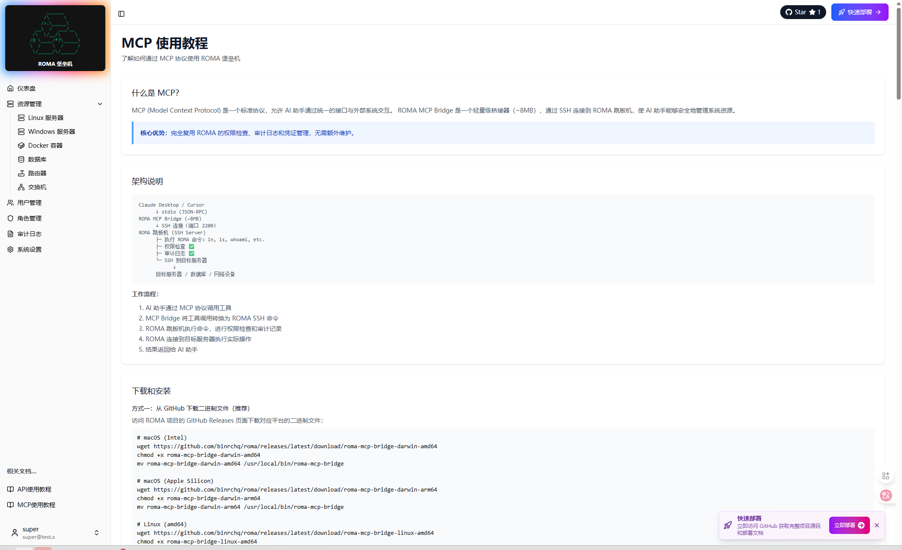

# ROMA 堡垒机 - 前端管理界面

基于 React + Vite + TailwindCSS 构建的ROMA 堡垒机管理界面。

  

1763835026750.png
## 技术栈

- **React 18** - UI 框架
- **Vite** - 构建工具
- **TailwindCSS** - CSS 框架
- **React Router** - 路由管理
- **Axios** - HTTP 客户端
- **Zustand** - 状态管理

## 功能特性

- 🎨 现代化的 UI 设计
- 📊 实时仪表盘数据展示
- 🖥️ 资源管理（Linux/Windows/Docker/数据库/网络设备）
- 👥 用户和角色管理
- 📝 访问日志查看
- ⚙️ 系统设置配置
- 🔐 API Key 鉴权

## 快速开始

### 安装依赖

\`\`\`bash
npm install
\`\`\`

### 开发模式

\`\`\`bash
npm run dev
\`\`\`

访问 http://localhost:3000

### 生产构建

\`\`\`bash
npm run build
\`\`\`

### 预览构建

\`\`\`bash
npm run preview
\`\`\`

## 项目结构

\`\`\`
src/
├── components/       # 可复用组件
│   └── Layout.jsx   # 主布局组件
├── pages/           # 页面组件
│   ├── Dashboard.jsx
│   ├── Resources.jsx
│   ├── Users.jsx
│   ├── Roles.jsx
│   ├── Logs.jsx
│   └── Settings.jsx
├── utils/           # 工具函数
│   └── api.js      # API 请求封装
├── App.jsx         # 应用入口
├── main.jsx        # React 入口
└── index.css       # 全局样式
\`\`\`

## API 配置

在 `src/utils/api.js` 中配置 API 基础地址：

\`\`\`javascript
const apiClient = axios.create({
  baseURL: '/api/v1',
})
\`\`\`

## 代理配置

开发环境下，Vite 会自动将 `/api` 请求代理到后端服务：

\`\`\`javascript
// vite.config.js
server: {
  proxy: {
    '/api': {
      target: 'http://localhost:8080',
      changeOrigin: true,
    }
  }
}
\`\`\`

## 注意事项

- 首次使用需要配置 API Key
- 确保后端服务已启动
- 建议使用 Chrome/Firefox 等现代浏览器

